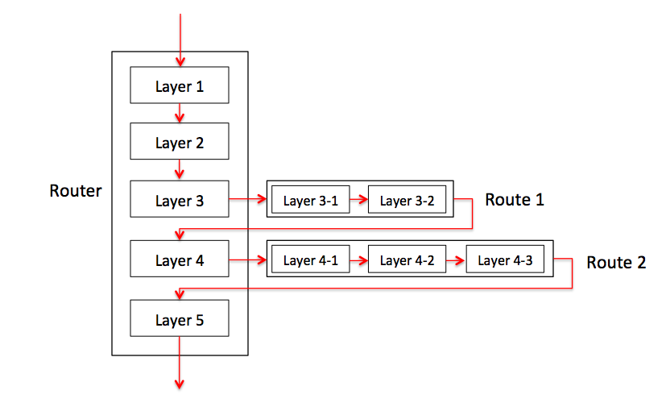
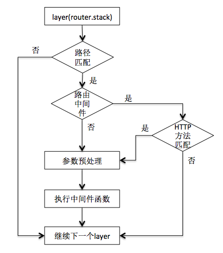

# Express 分析

## 理解app

在使用Express的时候，我们通过如下方式创建一个应用：

```
var express = require('express');
var app = express();

app.listen(3000);
```

而在不使用框架的时候，通常的做法是：

```
var http = require('http');

http.createServer(function(req, res) {
        res.write('hello world');
        res.end();
    })
    .listen(8000);
```

通过查看源码，可以发现，express实际上就是一个工厂函数，用来创建app，而app则就是createServer的回调函数。相关源码如下：

```
// in express.js
function createApplication() {
  var app = function(req, res, next) {
    app.handle(req, res, next);
  };

  // ... ...
  
  return app;
}

// in application.js
app.listen = function(){
  var server = http.createServer(this);
  return server.listen.apply(server, arguments);
};
```

因此，在使用Express的时候，事实上，所有的请求都是交给app，通过app.handle来处理了。

通过分析application.js的源码，可以归纳出，app主要有如下属性和方法：

* settings，{}，主要是一些设置信息，相关方法有：

    * set(setting, value)，有value的时候进行设置，无value的时候进行获取
    * get(setting)
    * enabled(setting)
    * disabled(setting)
    * enable(setting)
    * disable(setting)
* cache，{}

    * engines，{}，设置模版引擎，相关方法有：
    * engine(ext, fn)
    
* locals，{}
mountpath，字符串，相关方法有：

    * use(path, app)，会设置app的mountpath的值

    * path()，获取应用的绝对路径值
* _router，Router对象，相关方法有（由于参数可以有多种形式，因此并未列出参数）：
    * route()，创建一条路由，会调用Router.route
    * METHOD()，创建一条路由，并调用VERB方法，会调用Router.route
    * all()，创建一条路由，并调用所有的VERB方法，会调用Router.route
    * param()，会调用Router.param
    * use()，会调用Router.use
    
## Router

app有一个_router属性，事实上就是一个Router。Router相当于是一个中间件容器，存放着各种各样的中间件，大体上，可以分为路由中间件和其它中间件。Router的主要属性和方法有：

* params，{}
    * param()
* _params，[]
* caseSensitive，boolean
* mergeParam，boolean
* strcit，boolean
* stack，[]，存放着所有的中间件，相关方法有：
    * use()，使用中间件，本质上是向stack中添加一个Layer对象
    * route()，创建路由中间件，本质上是创建一个Route对象，并使用该Route对象创建一个Layer对象，将此layer对象添加到stack中
    * METHOD()，创建路由中间件，并添加处理函数，实际上是调用了route()方法

每个中间件都是一个Layer对象，Layer对象的基本属性有：

* handle，function，表示中间件函数
* name，string，中间件函数的名字，如果为匿名函数则为<anonymous>
* params，undefined，在执行match的时候赋值
* path，undefiend，在执行match的时候赋值
* regexp，RegExp，路径的正则表达形式
* keys，[]，保存的是路径中的参数及其相关的一些其它信息
* route，如果是路由中间件，则该属性为一个Route对象，否则为undefined。该属性不在Layer模块中定义，而是在Router模块中生成实例后定义

## 路由机制

在Router的stack中，存放着多个中间件，每一个中间件都是一个Layer对象，如果该中间件是一个路由中间件，则相应的Layer对象的route属性会指向一个Route对象，表示一条路由。Route的主要属性和方法有：

* path，string，表示路径
* stack，[]，存放的是Layer对象，表示路由处理函数
* methods，{}，表明支持哪些HTTP方法，例如{ get: true }，如果使用了all()，则该属性值为{ _all: true }

需要注意的是，Route的stack与Router的stack存放的都是Layer对象，但是这两种Layer之间有少许差别，主要如下：

* 都具有handle，name，params，path，regexp，keys属性，这几个属性都是在Layer模块的构造函数中定义的
* Router中的Layer对象具有route属性，如果该属性不为undefined，则表明为一个路由中间件；而Route中的Layer对象没有route属性
* Route中的Layer对象具有method属性，表明该路由函数的HTTP方法；而Router中的Layer对象没有method属性
* Route中的Layer对象的keys属性值均为[]，regexp属性值均为/^\/?$/i，因为在Route模块中创建Layer对象时使用的是Layer('/', {}, fn)

创建路由的主要方法及其调用过程如下：

* app.METHOD() → router.route → route.METHOD()
* app.all() → router.route → route.METHOD()
* app.route() → router.route

例如：

```
app.all('/users', function() {});
app.get('/users/:username', function() {});
app.route('/test').get(function() {}).post(function() {});
```

* 对于同一路径的多次路由添加会创建多条路由，例如：

```
app.get('/users', function test() {});
app.get('/users', function foo() {}, function bar() {});
```

该例子会创建两条路由，其中第一条路有一个处理函数，而第二条路由有两个处理函数。

## 请求处理

当请求到来时，处理过程是app.handle → router.handle，事实上，app.handle调用了router.handle，而router.handle的过程，则是依次对router.stack中存放的中间件进行调用。示例图如下：



router.stack中存的是一个个的Layer对象，用来管理中间件。如果Layer对象表示的是一个路由中间件，则其route属性会指向一个Route对象，而route.stack中存放的也是一个个的Layer对象，用来管理路由处理函数。

因此，当一个请求到来的时候，会依次通过router.stack中的Layer对象，如果遇到路由中间件，则会依次通过route.stack中的Layer对象。

对于router.stack中的每个Layer对象，会先判断是否匹配请求路径，如果不匹配，则跳过，继续下一个。在路径匹配的情况下，如果是非路由中间件，则执行该中间件函数；如果是路由中间件，则继续判断该中间件的路由对象能够处理请求的HTTP方法，如果不能够处理，则跳过继续下一个，如果能够处理则对route.stack中的Layer对象（与请求的HTTP方法匹配的）依次执行。示例图如下：



在中间件函数执行之前，会先对参数进行预处理，即router.process_params。对于每个参数的预处理只会进行一次，但是由于每个layer执行之前都会有参数预处理的过程，因此有一个缓存系统，来记录哪些参数已经处理过了。

## 中间件

在Express中，中间件（Middleware）是一个非常重要的概念。总的来说，中间件就是一个函数，用来处理请求和响应。Express应用事实上就是一个个的中间件的组合。大体上，中间件可以分为路由中间件和非路由中间件，两者主要区别如下：

* 非路由中间件主要通过app.use(path, fn)方式添加，而路由中间件主要通过app.VERB(path, fn)或app.route(path)方式添加
* 非路由中间件是匹配所有以path开始的请求，而路由中间件是精确匹配path。例如app.use('/user', foo)将会匹配所有路径以/user开始的请求，而app.get('/user', bar)则仅仅匹配路径是/user的请求。造成这一区别的主要是在构造Layer对象的时候，options.end取值不同，对于非路由中间件，其值为false，对于路由中间件，其值为true

对于非路由中间件，也可以再次进行分类，主要有如下几种：

* 普通中间件
* 二级路由
* 子应用

（1）普通中间件

普通中间件就是一个普通的函数，例如：

```
app.use('/user', function(req, res, next) {
	console.log('hello user');
	next();
});
```

（2）二级路由

二级路由也就是将一个Router对象作为中间件。随着应用规模的增长，可能需要配置多条路由，那么就会有很多条app.VERB语句，此时将路由配置相关代码分离出来作为一个单独的模块则会更好一些，例如：

```
var routes = require('./routes/index');
var users = require('./routes/users');

app.use('/', routes);
app.use('/users', users);
```

而在users模块中，代码为：

```
var express = require('express');
var router = express.Router();

router.get('/', function(req, res, next) {
	res.send('respond with a resource');
});

module.exports = router;
```

这个例子也就是使用了二级路由。我们知道，中间件需要是一个函数，而且该函数的参数形式为(req, res, next)形式。Express在设计上很巧妙的一点就是，Router本身就是一个函数，其形式为：

```
// 源码在router/index.js中
function router(req, res, next) {
	router.handle(req, res, next);
}
```

一个Router对象，在作为中间件容器和作为二级路由的时候，其调用方式也是存在着一定的差异的：

如果是作为中间件容器，那么在调用app.handle()的时候，会显式地调用router.handle()
如果是作为二级路由，则它本身就是作为中间件而存在的，会在layer.handle_request()的时候，调用router()，从而调用router.handle()

（3）子应用

一个Express应用也可以作为一个中间件，例如：

```
var subApp = express();
app.use(subApp);
```


