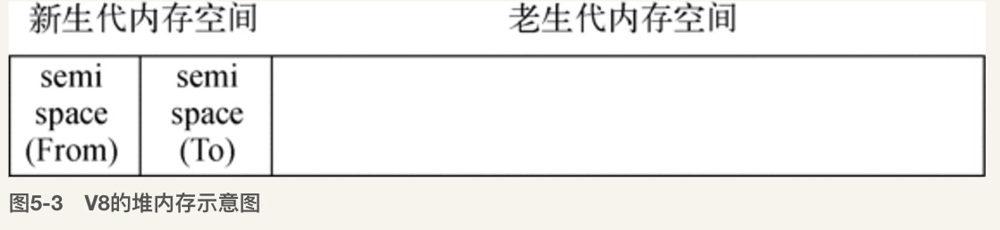
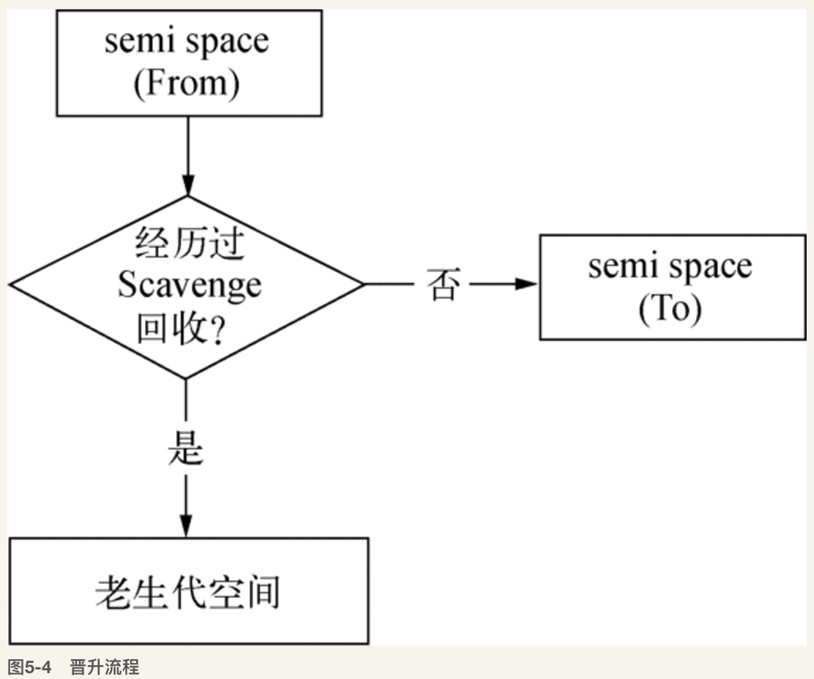
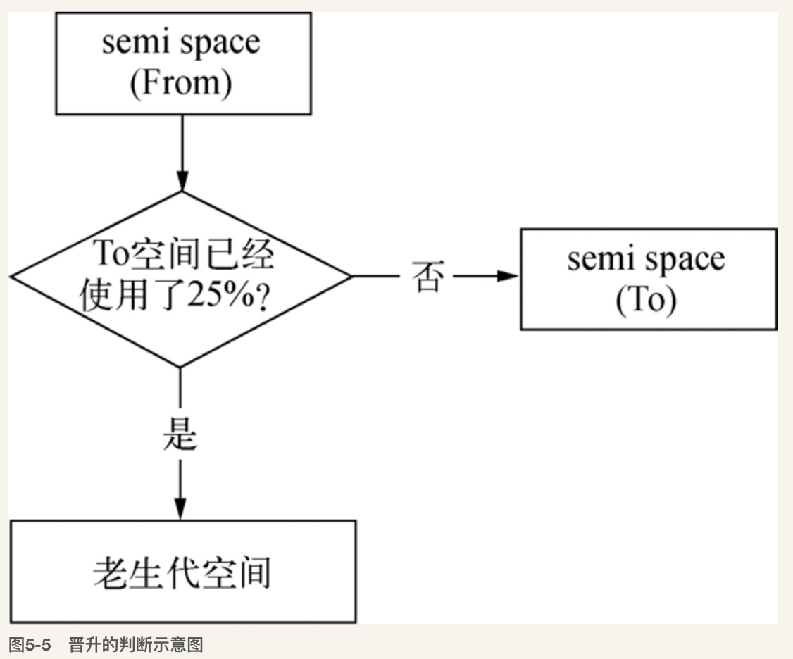
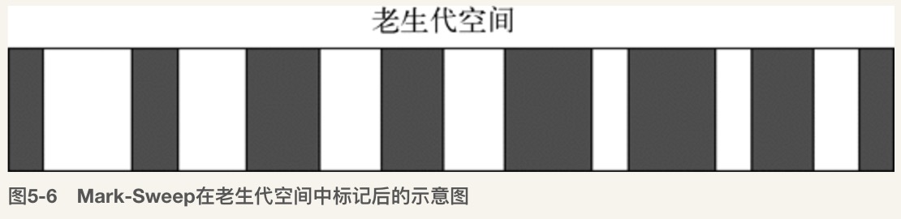
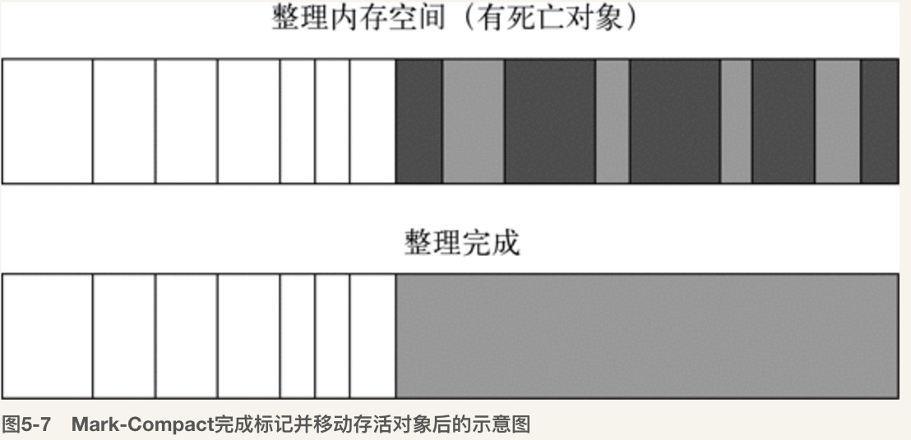
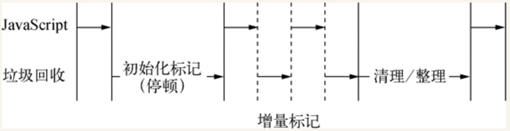
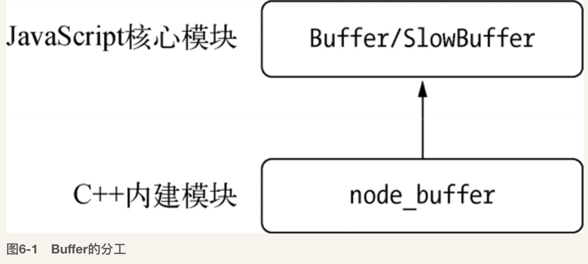
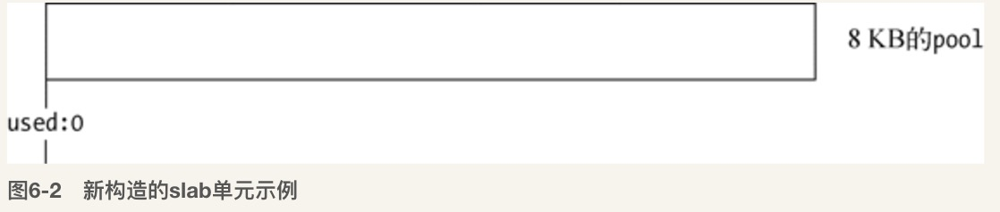
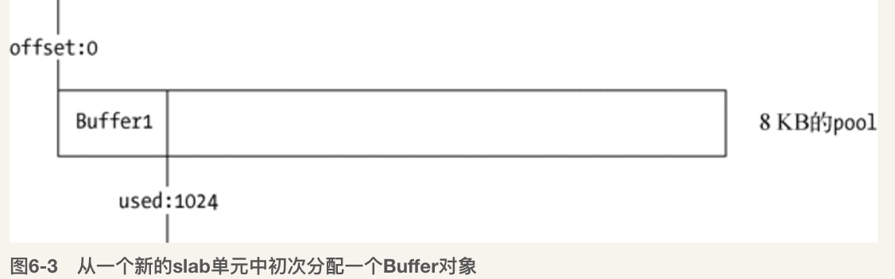

# 异步I/O

[I/O 模型分享](./IO_share.pptx)

## Node的异步I/O

### 事件循环

Node自身的执行模型--事件循环

在进程启动时，Node便会创建一个类似于while(true)的循环，每执行一次循环体的过程称为Tick，每个Tick的过程就是查看是否有事件待处理，如果有，就取出事件及相关的毁掉函数，如果存在关联的回调函数则执行，然后进入下一个循环，如果不再有事件处理，就退出进程

在每个Tick的过程中，如何判断是否有事件需要处理呢？需要引入**观察者**的概念，每个事件循环中有一个或者多个观察者，而判断是否有事件要处理的过程就是向这些观察者询问是否有要处理的事件


事件循环是一个典型的生产者／消费者模型。异步I/O、网络请求等则是事件的生产者，源源不断为Node提供不同类型的事件，这些事件被传递到对应的观察者那里，事件循环则从观察者那里取出事件并处理


从JavaScript调用Node的核心模块，核心模块调用C++内建模块，内建模块通过libuv进行系统调用，这是Node里经典的调用方式，由JavaScript层面发起的异步调用的第一阶段就结束。JavaScript线程可以继续执行当前任务的后续操作，当前的I／O操作在线程池中等待执行，不管它是否阻塞I/O,都不会影响到JS线程的后续执行，从而达到了异步的目的

请求对象时异步I/O过程中的重要中间产物，所有的状态都保存在这个对象中，包括送入线程池等待执行以及I／O操作完毕后的回调处理

组装好请求对象、送入I／O线程池等待执行，实际上完成了异步I/O的第一部分，回调通知是第二部分。


### 非I/O的异步API

* setTimeout
* setInterval

    上面两个与浏览器中的API是一致的，分别用于单次和多次定时执行任务，他们的实现原理与异步I/O比较类似，只是不需要I／O线程池的参与，调用两者创建的定时器会被插入到定时器观察者内部的一个红黑树中，每次Tick执行时，会从该红黑树中迭代取去定时器对象，检查是否超过定时时间，如果超过，就形成一个事件，它的回调函数将立即执行，而setInterval则是重复性的检测和执行，定时器的问题是非精确的。
    
    
    
* setImmediate

    process.nextTick() > setImmediate() 因为在于事件循环对观察者的检查是有先后顺序的，process.nextTick()属于idle观察者，setImmediate()属于check观察者，在每一个轮循环检查中，idle观察者 > I/O观察者，I／O观察者先于check观察者
    
* process.nextTick

    每次调用`process.nextTick()`方法，只会将回调函数放入队列中，在下一轮Tick时取出执行，定时器中采用红黑树的操作时间复杂度为O(lg(n)),nextTick()是O（1）
    

具体实现上，process.nextTick()的回调函数保存在一个数组中，setImmediate()的结果保存在链表中，在行为上，process.nextTick()在每轮的循环中将数组中的回调函数全部执行完，而setImmediate()在每轮循环中执行链表中的一个回调函数

```
process.nextTick(function () {
    console.log('nextTick延迟执行1');
});
process.nextTick(function () { 
    console.log('nextTick延迟执行2');
});
// 加入两个setImmediate()的回调函数
setImmediate(function () {
    console.log('setImmediate延迟执行1'); 
    // 进入下次循环 
    process.nextTick(function () {
        console.log('强势插入');
    });
});
setImmediate(function () {
    console.log('setImmediate延迟执行2'); 
});

console.log('正常执行');
```

老版本的Node会优先执行process.nextTick。 
当process.nextTick队列执行完后再执行一个setImmediate任务。然后再次回到新的事件循环。所以执行完第一个setImmediate后，队列里只剩下第一个setImmediate里的process.nextTick和第二个setImmediate。所以process.nextTick会先执行。

而在新版的Node中，process.nextTick执行完后，会循环遍历setImmediate，将setImmediate都执行完毕后再跳出循环。所以两个setImmediate执行完后队列里只剩下第一个setImmediate里的process.nextTick。最后输出”强势插入”。

**观察者优先级**

在每次轮训检查中，各观察者的优先级分别是：

idle观察者 > I/O观察者 > check观察者。

idle观察者：process.nextTick

I/O观察者：一般性的I/O回调，如网络，文件，数据库I/O等

check观察者：setImmediate，setTimeout

## 异步编程

### 函数式编程

**高阶函数**

高阶函数则是可以把函数作为参数，或是将函数作为返回值的函数

**偏函数用法**

偏函数用法是指创建一个调用另外一个部分--参数或变量已经预置的函数--的用法
    
```
var toString = Object.prototype.toString;
var isType = function() {
    return function(obj) {
        return toString.call(obj) == '[object ' + type + ']';
    }
}
```
### 异步编程的优势和难点

**异常处理**

Node在处理异常上形成了一种约定，将异常作为回调函数的第一个实参传回，如果是空值，则表示异步调用没有异常抛出

**函数嵌套过深**

有时候，数据、模版、资源文件，这三者之间互相依赖，从而导致了函数嵌套过深

**阻塞代码**

对于进入JS世界不久的开发者，没有类似于sleep()这样的线程沉睡功能，唯独能用于延时的操作只有setInterval、setTimeout()这两个函数，但是不能阻塞后面的代码的持续执行

如果使用时间阻塞的方式去做，会持续占用CPI进行判断，与真正的线程沉睡相差甚远，因为Node单线程，CPU的资源全部都会用于为这段代码服务，导致其余请求都不会得到响应

使用setTimeout会更好

**多线程编程**


因为Node是单线程，所以很难利用现在多核的特点。浏览器提出了web workerer的思想，是一个利用消息机制合理使用多核CPU的理想模型。

Node借鉴了这个模式，`child_process`使其基础API，`cluster`模块是更深层次的应用

### 异步编程解决方案

* 事件发布／订阅模式
* Promise/Deferred模式
* 流程控制库

### 异步并发控制

**bagpipe的解决方案**
 
* 通过一个队列来控制并发量
* 如果当前活跃（指调用发起但未执行回调）的异步调用量小于限定值，从队列中取出执行
* 如果活跃调用大道限定值，调用暂时存放在队列中
* 每个异步调用结束时，从队列中取出新的异步调用执行
       
[bagpipe](./bagpipe.js)
****

## 内存控制

在一般的后端开发语言中，在基本的内存使用上没有什么限制，然而在Node中通过JS使用内存时就会发现只能使用部分内存，从而导致Node无法直接操作大内存对象，主要原因就是Node基于V8构建，JS对象基本上都是通过V8自己的方式来进行分配和管理的

### V8的对象分配

在V8中，所有的JS对象都是通过堆来进行分配的，Node提供了V8种内存使用量的查看方式

```
> process.memoryUsage()
{ rss: 25440256,
  heapTotal: 7319552,
  heapUsed: 4039624,
  external: 8797 }

```

为什么要限制堆的大小？

* V8最初为浏览器设计的，不太可能遇到大量内存的场景
* V8的垃圾回收机制的限制，以1.5G的垃圾回收内存为例，V8做一次小的垃圾回收需要50ms以上，做一次非增量式的垃圾回收需要1s以上，这是垃圾回收引起JS线程暂停的事件，这样的事件花销下，应用的性能和响应能力会下降无法接受，所以限制了内存

[V8垃圾回收算法](https://segmentfault.com/a/1190000000440270)

### V8的垃圾回收机制

V8的垃圾回收策略主要基于分布式垃圾回收机制，在自动垃圾回收的演变过程中，人发现没有一种垃圾回收算法能够胜任所有的场景，所以，现代的垃圾回收算法中按照对象的存活时间将内存的垃圾回收进行不同的分代，然后对不同分代的内存施以更高效的算法

**V8的内存分代**
 
* 新生代 对象存活时间较短
* 老生代 存活时间较长或常驻内存的对象


在分代的基础上，新生代的对象主要通过**Scavenge**算法，主要采用了Cheney算法

Cheney算法是一种采用复制的方式实现的垃圾回收算法。它将堆内存一分为二，每一部分空间称为semispace。在这两个semispace空间中，只有一个处于使用中，另一个处于闲置状态。处于使用状态的semispace空间称为From空间，处于闲置状态的空间称为To空间。当我们分配对象时，先是在From空间中进行分配。当开始进行垃圾回收时，会检查From空间中的存活对象，这些存活对象将被复制到To空间中，而非存活对象占用的空间将会被释放。完成复制后，From空间和To空间的角色发生对换。简而言之，在垃圾回收的过程中，就是通过将存活对象在两个semispace空间之间进行复制。

Scavenge的缺点是只能使用堆内存中的一半，这是由划分空间和复制机制所决定的。但Scavenge由于只复制存活的对象，并且对于生命周期短的场景存活对象只占少部分，所以它在时间效率上有优异的表现。



对象晋升的条件主要有两个，一个是对象是否经历过Scavenge回收，一个是To空间的内存占用比超过限制





**Mark-Sweep & Mark-Compact**

在老生代中的对象，存活对象占较大比重，不适合采用Scavenge的方法，因为复制效率低和会浪费一半空间的问题，所以V8在老生代中主要采用了Mark-Sweep和Mark-Compact相结合的方式进行垃圾回收

Mark-Sweep是标记清除的意思，分为标记和清除两个阶段，Mark-Sweep在标记阶段遍历堆中的所有对象，并标记活着的对象，在随后的清除阶段中，只清除没有被标记的对象



Mark-Sweep最大的问题是在进行一次标记清除回收后，内存空间会出现不连续的状态。这种内存碎片会对后续的内存分配造成问题，因为很可能出现需要分配一个大对象的情况，这时所有的碎片空间都无法完成此次分配，就会提前触发垃圾回收，而这次回收是不必要的。

为了解决Mark-Sweep的内存碎片问题，Mark-Compact被提出来。Mark-Compact是标记整理的意思，是在Mark-Sweep的基础上演变而来的。它们的差别在于对象在标记为死亡后，在整理的过程中，将活着的对象往一端移动，移动完成后，直接清理掉边界外的内存



为了避免JS应用逻辑与垃圾回收器看到的不一致的情况，垃圾回收的3种基本算法需要将应用逻辑暂停下来，待执行完垃圾回收后再恢复执行应用逻辑，这种行为为“全停顿”，在V8的分代式垃圾回收中，一次小垃圾回收只收集新生代，因为新生代的存活对象通常比较小，所以使用全停顿的影响不大，但是老生代的话，使用的是增量标记，拆分成许多小步，每做完一个小步，就让JS应用逻辑执行一会儿



### 高效使用内存

在正常的JS执行中，无法立即回收的内存有闭包盒全局变量引用，所以要小心这两者的数量

### 内存指标

```
> process.memoryUsage()
{ rss: 25137152,
  heapTotal: 7319552,
  heapUsed: 3983144,
  external: 8801 }
  
```

rss是resident set size 即进程的常驻内存部分，进的内存总共有几部分，一部分是rss，其余部分在交换区或者文件系统中

**查看系统的内存占用**

`os.totalmem()` 系统的总内存

`os.freemem()`  系统的闲置内存

### 内存泄漏

通常造成内存泄漏的原因有：

* 缓存
* 队列消费不及时
* 作用域未释放

**慎将内存当做缓存**

一旦一个对象被当做缓存来使用，那就意味着它将会常驻在老生代中。缓存中存储的键越多，长期存活的对象也就越多，这将导致垃圾回收在进行扫描和整理时，对这些对象做无用功

利用对象的键值对来缓存东西不是严格意义上的缓存，因为严格意义上的缓存有完整的过期策略

**缓存限制**

* 缓存限制策略，限制缓存的无限增长
    
    [limitablemap](./limitablemap.js)

* 缓存的解决方案

    采用进程外的缓存，缓存自身不存储状态，外部的缓存软件哟组合良好的缓存过期淘汰策略以及自有的内存管理，不影响Node进程的性能，主要解决了：
    
    * 将缓存转移到外部，减少常驻内存的对象的数量
    * 进程之间可以共享缓存

### 内存排查工具
    
* node-heapdump
* node-memwatch

    
### 大内存应用

大内存应用可以利用Node的源生模块`stream`

* createReadStream  创建可读流
* createWriteStream 创建可写流
* pipe 管道的概念

## 理解Buffer

### Buffer结构

Buffer是一个像Array的对象，但它主要用于操作字节

Buffer是一个典型的JS和C++结合的模块，性能部分由C++实现，非性能相关的部分由JS实现


Buffer属于堆外内存，Node在进程启动的时候就加载了，将其放在global上，在使用的时候不需要require使用 

中文字在UTF-8编码下占用3个元素，字母和半角标点符号占用1个元素

Buffer的元素为16进制的两位数，即0到255的数值

如果给Buffer赋值的数小于0 则 该数逐次加256，直到得到一个0到255之间的整数，如果大于255，逐次减256，直到得到0-255区间的数值，如果是小数，舍弃小数部分，只保留整数

### Buffer内存分配

Buffer对象的内存分配不是在V8的堆内存中，而是在Node的C++层面实现内存的申请的，Node在内存的使用上应用的是在C++层面申请内存、在JS中分配内存的策略

为了高效的使用申请来的内存，Node采用了slab分配机制，slab是一种动态内存管理机制，slab就是一块申请好的固定大小的内存区域，slab具有如下3中状态

* full
* partial
* empty

需要一个Buffer对象

```
new Buffer(size)
```

8KB为界限区分大小Buffer对象，这个8KB也就是每个slab的大小值，在JS层面，作为单元进行内存的分配

**分配小Buffer对象**

如果指定Buffer的大小少于8 KB，Node会按照小对象的方式进行分配。Buffer的分配过程中主要使用一个局部变量pool作为中间处理对象，处于分配状态的slab单元都指向它。以下是分配一个全新的slab单元的操作，它会将新申请的SlowBuffer对象指向它

```
var pool;
　
function allocPool() {
  pool = new SlowBuffer(Buffer.poolSize);
  pool.used = 0;
}
```



此时，slab处于empty状态

当构建小Buffer对象时，构造将会去检查pool对象，如果没有被创建，将会创建一个新的slab单元

```
if (!pool || pool.length - pool.used < this.length) allocPool();
```

同时当前Buffer对象的parent属性指向该slab，并记录下是从这个slab的哪个位置（offset）开始使用的，slab对象自身也记录被使用了多少字节，代码如下

```
this.parent = pool;
this.offset = pool.used;
pool.used += this.length;
if (pool.used & 7) pool.used = (pool.used + 8) & ~7; 
```



再创建对象时，构造过程中将会判断这个slab的剩余空间是不是够，如果够则使用剩余空间，并更新slab的分配状态，如果slab的剩余空间不够，将会创建新的slab，原slab中剩余的空间会造成浪费

```
new Buffer(1);
new Buffer(8192);

```

造成大量的空间被浪费

**分配大Buffer对象**

如果需要超过8 KB的Buffer对象，将会直接分配一个SlowBuffer对象作为slab单元，这个slab单元将会被这个大Buffer对象独占

```
this.parent = new SlowBuffer(this.length);
this.offset = 0;
```

### Buffer的转换

Buffer对象可以与字符串之间相互转换，目前支持的：

* ASCII
* UTF-8
* UTF-16LE/UCS-2
* Base64
* Binary
* Hex

**字符串转Buffer**

字符串转Buffer对象主要是通过构造函数完成的

`new Buffer(str, [encoding])`

`buf.write(string, [offset], [length], [encoding])` 可以写入多种编码格式的数据，但是不建议，因为所用的字节长度不同

**Buffer转字符串**

Buffer的toString()可以将Buffer对象转换为字符串

`buf.toString([encoding], [start], [end]) `

### Buffer的拼接

在拼接过程中，中文很容易出现乱码的问题，因为在UTF-8下，一个中文占3个字节

`setEncoding()与string_decoder()` 方法，可以给可读流设置编码的方法

```   
   readable.setEncoding(encoding) 
```

该方法的作用是让data事件中传递的不再是Buffer对象，而是编码后的字符串

在调用setEncoding()时，可读对象在内部设置了一个decoder对象，每次data时间都要通过decoder对象进行Buffer到字符串的解码，然后传递给调用者。

但是无论如何转码，总是存在宽字节字符字符串被截断的问题

内部实现，设置编码后，stringDecoder知道是以几个字节存储的，那么，当字节不够的时候会先保留在StringDecoder实例内部，等到数据来到后再进行组装

只能处理Base64和UCS-2/UTF-16LE这3种编码,不是万能💊

**正确拼接Buffer**

剩下的解决方案只有将多个小Buffer对象拼接为一个Buffer对象

```
var chunks = [];
var size = 0;
res.on('data', function(chunk) {
    size += chunk.size;
    chunks.push(chunk);
})
res.on('end', function() {
    var buf = Buffer.concat(chunks, size);
    console.log(buf.toString('utf8'));
})

```


Buffer.concat()方法生成一个合并的Buffer对象

### Buffer 与性能

在网络运输中，它的性能很好，可以提高效率


文件读取

Buffer的使用除了与字符串的转换有性能损耗之外，在文件的读取时，又一个`highWaterMark`设置对性能的影响至关重要

`fs.createReadStream()`的工作方式是在内存中准备一段Buffer，然后再`fs.read()`读取时逐步从磁盘中将字节复制到Buffer中，完成一次读取时，则在这个Buffer中通过slice()方法取出部分数据作为一个小Buffer对象，在通过data时间传递给调用方，如果Buffer用完，则重新分配一个，如果还有剩余，则继续使用。

Buffer的内存分配比较类似，highWaterMark的大小对性能有两个影响的点
    
* highWaterMark 设置对Buffer内存的分配和使用有一定影响
* highWaterMark 设置过小，可能导致系统调用次数过多


