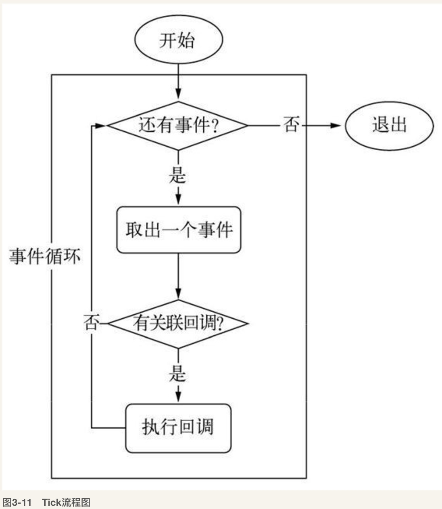
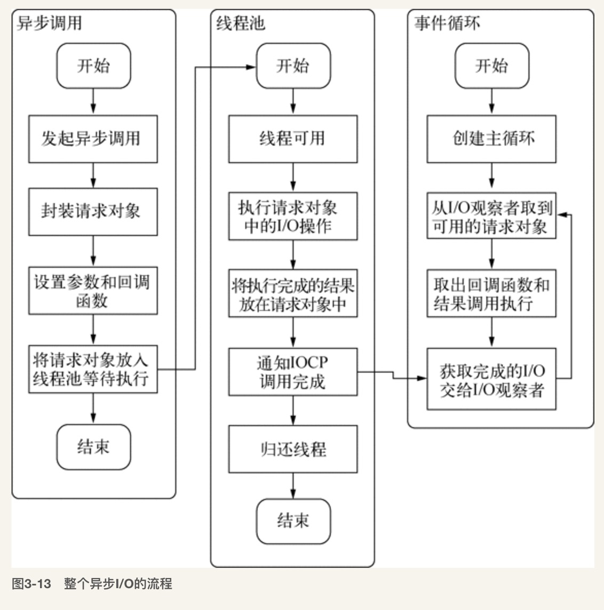
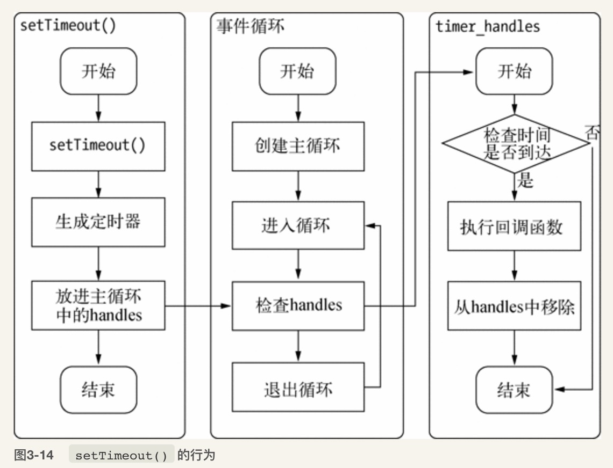

# 异步I/O

[I/O 模型分享](./IO_share.pptx)

## Node的异步I/O

### 事件循环

Node自身的执行模型--事件循环

在进程启动时，Node便会创建一个类似于while(true)的循环，每执行一次循环体的过程称为Tick，每个Tick的过程就是查看是否有事件待处理，如果有，就取出事件及相关的毁掉函数，如果存在关联的回调函数则执行，然后进入下一个循环，如果不再有事件处理，就退出进程

在每个Tick的过程中，如何判断是否有事件需要处理呢？需要引入**观察者**的概念，每个事件循环中有一个或者多个观察者，而判断是否有事件要处理的过程就是向这些观察者询问是否有要处理的事件



事件循环是一个典型的生产者／消费者模型。异步I/O、网络请求等则是事件的生产者，源源不断为Node提供不同类型的事件，这些事件被传递到对应的观察者那里，事件循环则从观察者那里取出事件并处理


从JavaScript调用Node的核心模块，核心模块调用C++内建模块，内建模块通过libuv进行系统调用，这是Node里经典的调用方式，由JavaScript层面发起的异步调用的第一阶段就结束。JavaScript线程可以继续执行当前任务的后续操作，当前的I／O操作在线程池中等待执行，不管它是否阻塞I/O,都不会影响到JS线程的后续执行，从而达到了异步的目的

请求对象时异步I/O过程中的重要中间产物，所有的状态都保存在这个对象中，包括送入线程池等待执行以及I／O操作完毕后的回调处理

组装好请求对象、送入I／O线程池等待执行，实际上完成了异步I/O的第一部分，回调通知是第二部分。



### 非I/O的异步API

* setTimeout
* setInterval

    上面两个与浏览器中的API是一致的，分别用于单次和多次定时执行任务，他们的实现原理与异步I/O比较类似，只是不需要I／O线程池的参与，调用两者创建的定时器会被插入到定时器观察者内部的一个红黑树中，每次Tick执行时，会从该红黑树中迭代取去定时器对象，检查是否超过定时时间，如果超过，就形成一个事件，它的回调函数将立即执行，而setInterval则是重复性的检测和执行，定时器的问题是非精确的。
    
    
    
* setImmediate

    process.nextTick() > setImmediate() 因为在于事件循环对观察者的检查是有先后顺序的，process.nextTick()属于idle观察者，setImmediate()属于check观察者，在每一个轮循环检查中，idle观察者 > I/O观察者，I／O观察者先于check观察者
    
* process.nextTick

    每次调用`process.nextTick()`方法，只会将回调函数放入队列中，在下一轮Tick时取出执行，定时器中采用红黑树的操作时间复杂度为O(lg(n)),nextTick()是O（1）
    

具体实现上，process.nextTick()的回调函数保存在一个数组中，setImmediate()的结果保存在链表中，在行为上，process.nextTick()在每轮的循环中将数组中的回调函数全部执行完，而setImmediate()在每轮循环中执行链表中的一个回调函数

```
process.nextTick(function () {
    console.log('nextTick延迟执行1');
});
process.nextTick(function () { 
    console.log('nextTick延迟执行2');
});
// 加入两个setImmediate()的回调函数
setImmediate(function () {
    console.log('setImmediate延迟执行1'); 
    // 进入下次循环 
    process.nextTick(function () {
        console.log('强势插入');
    });
});
setImmediate(function () {
    console.log('setImmediate延迟执行2'); 
});

console.log('正常执行');
```

老版本的Node会优先执行process.nextTick。 
当process.nextTick队列执行完后再执行一个setImmediate任务。然后再次回到新的事件循环。所以执行完第一个setImmediate后，队列里只剩下第一个setImmediate里的process.nextTick和第二个setImmediate。所以process.nextTick会先执行。

而在新版的Node中，process.nextTick执行完后，会循环遍历setImmediate，将setImmediate都执行完毕后再跳出循环。所以两个setImmediate执行完后队列里只剩下第一个setImmediate里的process.nextTick。最后输出”强势插入”。

**观察者优先级**

在每次轮训检查中，各观察者的优先级分别是：

idle观察者 > I/O观察者 > check观察者。

idle观察者：process.nextTick

I/O观察者：一般性的I/O回调，如网络，文件，数据库I/O等

check观察者：setImmediate，setTimeout


    


