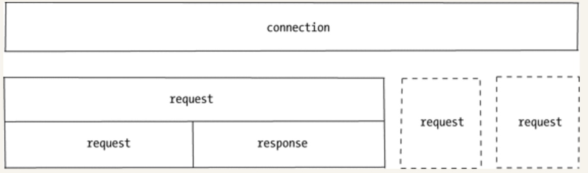
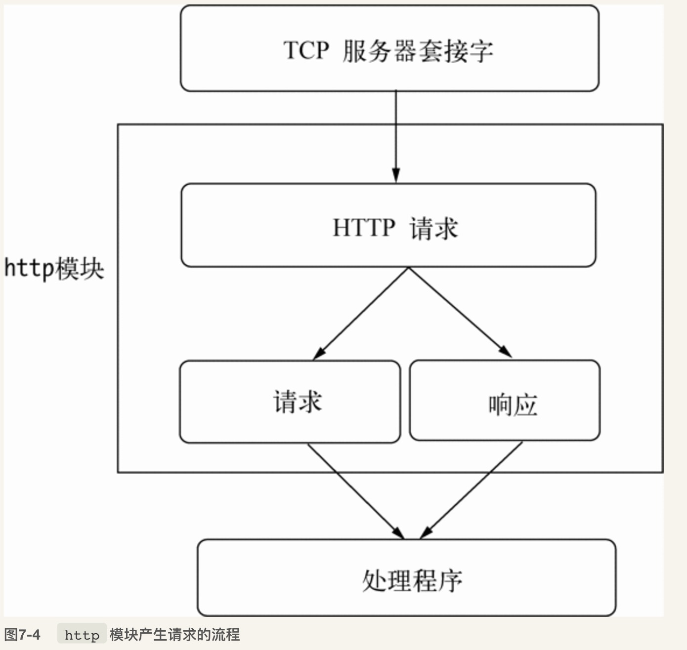
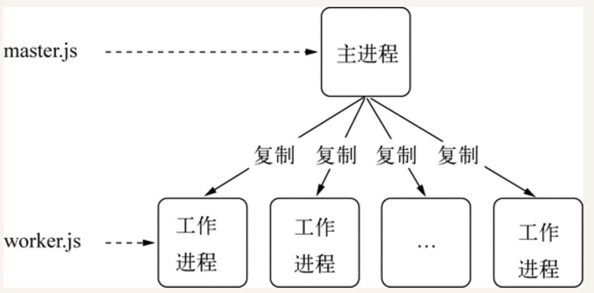
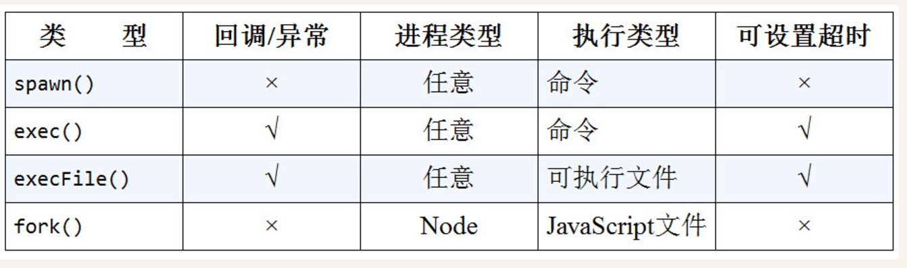
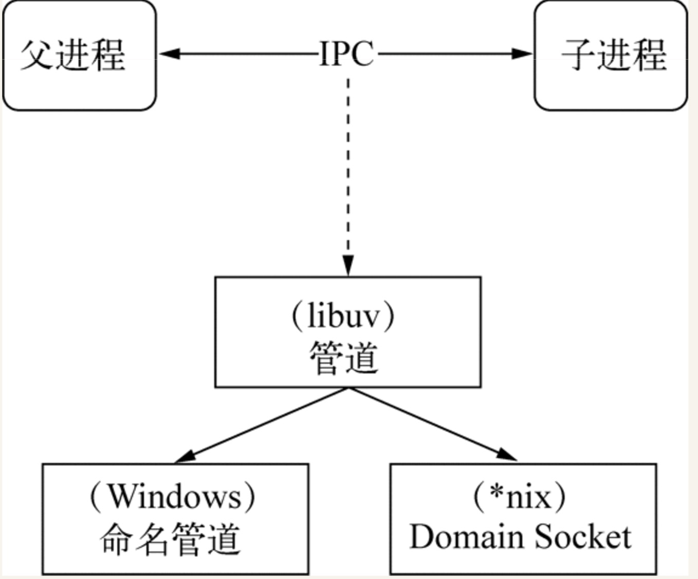
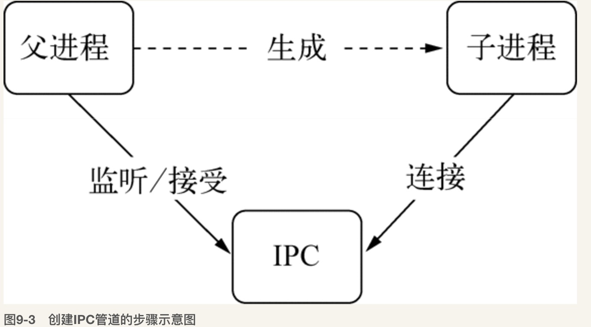
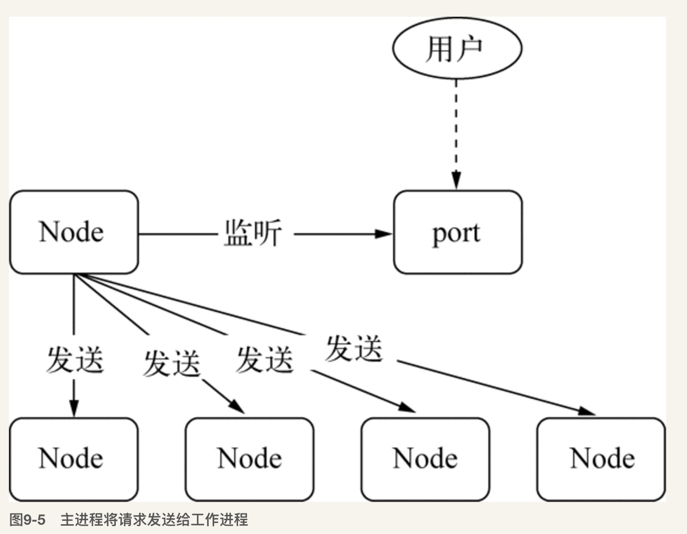
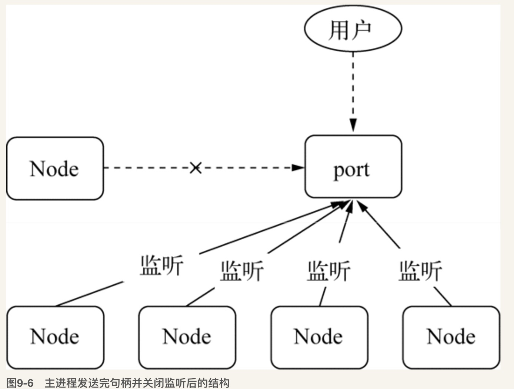

# 异步I/O

[I/O 模型分享](./IO_share.pptx)

## Node的异步I/O

### 事件循环

Node自身的执行模型--事件循环

在进程启动时，Node便会创建一个类似于while(true)的循环，每执行一次循环体的过程称为Tick，每个Tick的过程就是查看是否有事件待处理，如果有，就取出事件及相关的毁掉函数，如果存在关联的回调函数则执行，然后进入下一个循环，如果不再有事件处理，就退出进程

在每个Tick的过程中，如何判断是否有事件需要处理呢？需要引入**观察者**的概念，每个事件循环中有一个或者多个观察者，而判断是否有事件要处理的过程就是向这些观察者询问是否有要处理的事件


事件循环是一个典型的生产者／消费者模型。异步I/O、网络请求等则是事件的生产者，源源不断为Node提供不同类型的事件，这些事件被传递到对应的观察者那里，事件循环则从观察者那里取出事件并处理


从JavaScript调用Node的核心模块，核心模块调用C++内建模块，内建模块通过libuv进行系统调用，这是Node里经典的调用方式，由JavaScript层面发起的异步调用的第一阶段就结束。JavaScript线程可以继续执行当前任务的后续操作，当前的I／O操作在线程池中等待执行，不管它是否阻塞I/O,都不会影响到JS线程的后续执行，从而达到了异步的目的

请求对象时异步I/O过程中的重要中间产物，所有的状态都保存在这个对象中，包括送入线程池等待执行以及I／O操作完毕后的回调处理

组装好请求对象、送入I／O线程池等待执行，实际上完成了异步I/O的第一部分，回调通知是第二部分。


### 非I/O的异步API

* setTimeout
* setInterval

    上面两个与浏览器中的API是一致的，分别用于单次和多次定时执行任务，他们的实现原理与异步I/O比较类似，只是不需要I／O线程池的参与，调用两者创建的定时器会被插入到定时器观察者内部的一个红黑树中，每次Tick执行时，会从该红黑树中迭代取去定时器对象，检查是否超过定时时间，如果超过，就形成一个事件，它的回调函数将立即执行，而setInterval则是重复性的检测和执行，定时器的问题是非精确的。
    
    
    
* setImmediate

    process.nextTick() > setImmediate() 因为在于事件循环对观察者的检查是有先后顺序的，process.nextTick()属于idle观察者，setImmediate()属于check观察者，在每一个轮循环检查中，idle观察者 > I/O观察者，I／O观察者先于check观察者
    
* process.nextTick

    每次调用`process.nextTick()`方法，只会将回调函数放入队列中，在下一轮Tick时取出执行，定时器中采用红黑树的操作时间复杂度为O(lg(n)),nextTick()是O（1）
    

具体实现上，process.nextTick()的回调函数保存在一个数组中，setImmediate()的结果保存在链表中，在行为上，process.nextTick()在每轮的循环中将数组中的回调函数全部执行完，而setImmediate()在每轮循环中执行链表中的一个回调函数

```
process.nextTick(function () {
    console.log('nextTick延迟执行1');
});
process.nextTick(function () { 
    console.log('nextTick延迟执行2');
});
// 加入两个setImmediate()的回调函数
setImmediate(function () {
    console.log('setImmediate延迟执行1'); 
    // 进入下次循环 
    process.nextTick(function () {
        console.log('强势插入');
    });
});
setImmediate(function () {
    console.log('setImmediate延迟执行2'); 
});

console.log('正常执行');
```

老版本的Node会优先执行process.nextTick。 
当process.nextTick队列执行完后再执行一个setImmediate任务。然后再次回到新的事件循环。所以执行完第一个setImmediate后，队列里只剩下第一个setImmediate里的process.nextTick和第二个setImmediate。所以process.nextTick会先执行。

而在新版的Node中，process.nextTick执行完后，会循环遍历setImmediate，将setImmediate都执行完毕后再跳出循环。所以两个setImmediate执行完后队列里只剩下第一个setImmediate里的process.nextTick。最后输出”强势插入”。

**观察者优先级**

在每次轮训检查中，各观察者的优先级分别是：

idle观察者 > I/O观察者 > check观察者。

idle观察者：process.nextTick

I/O观察者：一般性的I/O回调，如网络，文件，数据库I/O等

check观察者：setImmediate，setTimeout

## 异步编程

### 函数式编程

**高阶函数**

高阶函数则是可以把函数作为参数，或是将函数作为返回值的函数

**偏函数用法**

偏函数用法是指创建一个调用另外一个部分--参数或变量已经预置的函数--的用法
    
```
var toString = Object.prototype.toString;
var isType = function() {
    return function(obj) {
        return toString.call(obj) == '[object ' + type + ']';
    }
}
```
### 异步编程的优势和难点

**异常处理**

Node在处理异常上形成了一种约定，将异常作为回调函数的第一个实参传回，如果是空值，则表示异步调用没有异常抛出

**函数嵌套过深**

有时候，数据、模版、资源文件，这三者之间互相依赖，从而导致了函数嵌套过深

**阻塞代码**

对于进入JS世界不久的开发者，没有类似于sleep()这样的线程沉睡功能，唯独能用于延时的操作只有setInterval、setTimeout()这两个函数，但是不能阻塞后面的代码的持续执行

如果使用时间阻塞的方式去做，会持续占用CPI进行判断，与真正的线程沉睡相差甚远，因为Node单线程，CPU的资源全部都会用于为这段代码服务，导致其余请求都不会得到响应

使用setTimeout会更好

**多线程编程**


因为Node是单线程，所以很难利用现在多核的特点。浏览器提出了web workerer的思想，是一个利用消息机制合理使用多核CPU的理想模型。

Node借鉴了这个模式，`child_process`使其基础API，`cluster`模块是更深层次的应用

### 异步编程解决方案

* 事件发布／订阅模式
* Promise/Deferred模式
* 流程控制库

### 异步并发控制

**bagpipe的解决方案**
 
* 通过一个队列来控制并发量
* 如果当前活跃（指调用发起但未执行回调）的异步调用量小于限定值，从队列中取出执行
* 如果活跃调用大道限定值，调用暂时存放在队列中
* 每个异步调用结束时，从队列中取出新的异步调用执行
       
[bagpipe](./bagpipe.js)
****

## 内存控制

在一般的后端开发语言中，在基本的内存使用上没有什么限制，然而在Node中通过JS使用内存时就会发现只能使用部分内存，从而导致Node无法直接操作大内存对象，主要原因就是Node基于V8构建，JS对象基本上都是通过V8自己的方式来进行分配和管理的

### V8的对象分配

在V8中，所有的JS对象都是通过堆来进行分配的，Node提供了V8种内存使用量的查看方式

```
> process.memoryUsage()
{ rss: 25440256,
  heapTotal: 7319552,
  heapUsed: 4039624,
  external: 8797 }

```

为什么要限制堆的大小？

* V8最初为浏览器设计的，不太可能遇到大量内存的场景
* V8的垃圾回收机制的限制，以1.5G的垃圾回收内存为例，V8做一次小的垃圾回收需要50ms以上，做一次非增量式的垃圾回收需要1s以上，这是垃圾回收引起JS线程暂停的事件，这样的事件花销下，应用的性能和响应能力会下降无法接受，所以限制了内存

[V8垃圾回收算法](https://segmentfault.com/a/1190000000440270)

### V8的垃圾回收机制

V8的垃圾回收策略主要基于分布式垃圾回收机制，在自动垃圾回收的演变过程中，人发现没有一种垃圾回收算法能够胜任所有的场景，所以，现代的垃圾回收算法中按照对象的存活时间将内存的垃圾回收进行不同的分代，然后对不同分代的内存施以更高效的算法

**V8的内存分代**
 
* 新生代 对象存活时间较短
* 老生代 存活时间较长或常驻内存的对象


在分代的基础上，新生代的对象主要通过**Scavenge**算法，主要采用了Cheney算法

Cheney算法是一种采用复制的方式实现的垃圾回收算法。它将堆内存一分为二，每一部分空间称为semispace。在这两个semispace空间中，只有一个处于使用中，另一个处于闲置状态。处于使用状态的semispace空间称为From空间，处于闲置状态的空间称为To空间。当我们分配对象时，先是在From空间中进行分配。当开始进行垃圾回收时，会检查From空间中的存活对象，这些存活对象将被复制到To空间中，而非存活对象占用的空间将会被释放。完成复制后，From空间和To空间的角色发生对换。简而言之，在垃圾回收的过程中，就是通过将存活对象在两个semispace空间之间进行复制。

Scavenge的缺点是只能使用堆内存中的一半，这是由划分空间和复制机制所决定的。但Scavenge由于只复制存活的对象，并且对于生命周期短的场景存活对象只占少部分，所以它在时间效率上有优异的表现。


对象晋升的条件主要有两个，一个是对象是否经历过Scavenge回收，一个是To空间的内存占用比超过限制


**Mark-Sweep & Mark-Compact**

在老生代中的对象，存活对象占较大比重，不适合采用Scavenge的方法，因为复制效率低和会浪费一半空间的问题，所以V8在老生代中主要采用了Mark-Sweep和Mark-Compact相结合的方式进行垃圾回收

Mark-Sweep是标记清除的意思，分为标记和清除两个阶段，Mark-Sweep在标记阶段遍历堆中的所有对象，并标记活着的对象，在随后的清除阶段中，只清除没有被标记的对象


Mark-Sweep最大的问题是在进行一次标记清除回收后，内存空间会出现不连续的状态。这种内存碎片会对后续的内存分配造成问题，因为很可能出现需要分配一个大对象的情况，这时所有的碎片空间都无法完成此次分配，就会提前触发垃圾回收，而这次回收是不必要的。

为了解决Mark-Sweep的内存碎片问题，Mark-Compact被提出来。Mark-Compact是标记整理的意思，是在Mark-Sweep的基础上演变而来的。它们的差别在于对象在标记为死亡后，在整理的过程中，将活着的对象往一端移动，移动完成后，直接清理掉边界外的内存


为了避免JS应用逻辑与垃圾回收器看到的不一致的情况，垃圾回收的3种基本算法需要将应用逻辑暂停下来，待执行完垃圾回收后再恢复执行应用逻辑，这种行为为“全停顿”，在V8的分代式垃圾回收中，一次小垃圾回收只收集新生代，因为新生代的存活对象通常比较小，所以使用全停顿的影响不大，但是老生代的话，使用的是增量标记，拆分成许多小步，每做完一个小步，就让JS应用逻辑执行一会儿


### 高效使用内存

在正常的JS执行中，无法立即回收的内存有闭包盒全局变量引用，所以要小心这两者的数量

### 内存指标

```
> process.memoryUsage()
{ rss: 25137152,
  heapTotal: 7319552,
  heapUsed: 3983144,
  external: 8801 }
  
```

rss是resident set size 即进程的常驻内存部分，进的内存总共有几部分，一部分是rss，其余部分在交换区或者文件系统中

**查看系统的内存占用**

`os.totalmem()` 系统的总内存

`os.freemem()`  系统的闲置内存

### 内存泄漏

通常造成内存泄漏的原因有：

* 缓存
* 队列消费不及时
* 作用域未释放

**慎将内存当做缓存**

一旦一个对象被当做缓存来使用，那就意味着它将会常驻在老生代中。缓存中存储的键越多，长期存活的对象也就越多，这将导致垃圾回收在进行扫描和整理时，对这些对象做无用功

利用对象的键值对来缓存东西不是严格意义上的缓存，因为严格意义上的缓存有完整的过期策略

**缓存限制**

* 缓存限制策略，限制缓存的无限增长
    
    [limitablemap](./limitablemap.js)

* 缓存的解决方案

    采用进程外的缓存，缓存自身不存储状态，外部的缓存软件哟组合良好的缓存过期淘汰策略以及自有的内存管理，不影响Node进程的性能，主要解决了：
    
    * 将缓存转移到外部，减少常驻内存的对象的数量
    * 进程之间可以共享缓存

### 内存排查工具
    
* node-heapdump
* node-memwatch

    
### 大内存应用

大内存应用可以利用Node的源生模块`stream`

* createReadStream  创建可读流
* createWriteStream 创建可写流
* pipe 管道的概念

## 理解Buffer

### Buffer结构

Buffer是一个像Array的对象，但它主要用于操作字节

Buffer是一个典型的JS和C++结合的模块，性能部分由C++实现，非性能相关的部分由JS实现


Buffer属于堆外内存，Node在进程启动的时候就加载了，将其放在global上，在使用的时候不需要require使用 

中文字在UTF-8编码下占用3个元素，字母和半角标点符号占用1个元素

Buffer的元素为16进制的两位数，即0到255的数值

如果给Buffer赋值的数小于0 则 该数逐次加256，直到得到一个0到255之间的整数，如果大于255，逐次减256，直到得到0-255区间的数值，如果是小数，舍弃小数部分，只保留整数

### Buffer内存分配

Buffer对象的内存分配不是在V8的堆内存中，而是在Node的C++层面实现内存的申请的，Node在内存的使用上应用的是在C++层面申请内存、在JS中分配内存的策略

为了高效的使用申请来的内存，Node采用了slab分配机制，slab是一种动态内存管理机制，slab就是一块申请好的固定大小的内存区域，slab具有如下3中状态

* full
* partial
* empty

需要一个Buffer对象

```
new Buffer(size)
```

8KB为界限区分大小Buffer对象，这个8KB也就是每个slab的大小值，在JS层面，作为单元进行内存的分配

**分配小Buffer对象**

如果指定Buffer的大小少于8 KB，Node会按照小对象的方式进行分配。Buffer的分配过程中主要使用一个局部变量pool作为中间处理对象，处于分配状态的slab单元都指向它。以下是分配一个全新的slab单元的操作，它会将新申请的SlowBuffer对象指向它

```
var pool;
　
function allocPool() {
  pool = new SlowBuffer(Buffer.poolSize);
  pool.used = 0;
}
```


此时，slab处于empty状态

当构建小Buffer对象时，构造将会去检查pool对象，如果没有被创建，将会创建一个新的slab单元

```
if (!pool || pool.length - pool.used < this.length) allocPool();
```

同时当前Buffer对象的parent属性指向该slab，并记录下是从这个slab的哪个位置（offset）开始使用的，slab对象自身也记录被使用了多少字节，代码如下

```
this.parent = pool;
this.offset = pool.used;
pool.used += this.length;
if (pool.used & 7) pool.used = (pool.used + 8) & ~7; 
```


再创建对象时，构造过程中将会判断这个slab的剩余空间是不是够，如果够则使用剩余空间，并更新slab的分配状态，如果slab的剩余空间不够，将会创建新的slab，原slab中剩余的空间会造成浪费

```
new Buffer(1);
new Buffer(8192);

```

造成大量的空间被浪费

**分配大Buffer对象**

如果需要超过8 KB的Buffer对象，将会直接分配一个SlowBuffer对象作为slab单元，这个slab单元将会被这个大Buffer对象独占

```
this.parent = new SlowBuffer(this.length);
this.offset = 0;
```

### Buffer的转换

Buffer对象可以与字符串之间相互转换，目前支持的：

* ASCII
* UTF-8
* UTF-16LE/UCS-2
* Base64
* Binary
* Hex

**字符串转Buffer**

字符串转Buffer对象主要是通过构造函数完成的

`new Buffer(str, [encoding])`

`buf.write(string, [offset], [length], [encoding])` 可以写入多种编码格式的数据，但是不建议，因为所用的字节长度不同

**Buffer转字符串**

Buffer的toString()可以将Buffer对象转换为字符串

`buf.toString([encoding], [start], [end]) `

### Buffer的拼接

在拼接过程中，中文很容易出现乱码的问题，因为在UTF-8下，一个中文占3个字节

`setEncoding()与string_decoder()` 方法，可以给可读流设置编码的方法

```   
   readable.setEncoding(encoding) 
```

该方法的作用是让data事件中传递的不再是Buffer对象，而是编码后的字符串

在调用setEncoding()时，可读对象在内部设置了一个decoder对象，每次data时间都要通过decoder对象进行Buffer到字符串的解码，然后传递给调用者。

但是无论如何转码，总是存在宽字节字符字符串被截断的问题

内部实现，设置编码后，stringDecoder知道是以几个字节存储的，那么，当字节不够的时候会先保留在StringDecoder实例内部，等到数据来到后再进行组装

只能处理Base64和UCS-2/UTF-16LE这3种编码,不是万能💊

**正确拼接Buffer**

剩下的解决方案只有将多个小Buffer对象拼接为一个Buffer对象

```
var chunks = [];
var size = 0;
res.on('data', function(chunk) {
    size += chunk.size;
    chunks.push(chunk);
})
res.on('end', function() {
    var buf = Buffer.concat(chunks, size);
    console.log(buf.toString('utf8'));
})

```


Buffer.concat()方法生成一个合并的Buffer对象

### Buffer 与性能

在网络运输中，它的性能很好，可以提高效率


文件读取

Buffer的使用除了与字符串的转换有性能损耗之外，在文件的读取时，又一个`highWaterMark`设置对性能的影响至关重要

`fs.createReadStream()`的工作方式是在内存中准备一段Buffer，然后再`fs.read()`读取时逐步从磁盘中将字节复制到Buffer中，完成一次读取时，则在这个Buffer中通过slice()方法取出部分数据作为一个小Buffer对象，在通过data时间传递给调用方，如果Buffer用完，则重新分配一个，如果还有剩余，则继续使用。

Buffer的内存分配比较类似，highWaterMark的大小对性能有两个影响的点
    
* highWaterMark 设置对Buffer内存的分配和使用有一定影响
* highWaterMark 设置过小，可能导致系统调用次数过多

## 网络编程

Node提供了net、dgram、http、https这四个模块，分别用于处理TCP、UDP、HTTP、HTTPS，适用于服务端和客户端

### 构建TCP服务

OSI模型：

* 物理层     网络物理硬件
* 数据链路层   网络特有的链路借口
* 网络层。     IP
* 传输层       TCP／UDP
* 会话层       通信链接／维持会话
* 表示层       加密／解密
* 应用层       HTTP

许多应用层协议是基于TCP的，典型的HTTP、SMTP、IMAP等协议


TCP通过三次握手连接后，会话形成，服务端和客户端之间才能互相发送数据，在创建会话的过程，服务端和客户端分别提供一个套接字，这两个套接字共同形成一个链接，服务端和客户端则通过套接字实现两者之间连接的操作

### TCP服务的事件

**服务器事件**

对于通过`net.createServer()`创建的服务器而言，是一个EventEmitter实例，自定义事件：

* listening： 调用server.listen()绑定端口时触发
* connection：每个客户端套接字连接到服务端时触发，`net.createServer()`
* close: 当服务器管事时触发，在调用server.close()后，服务器将停止接受新的套接字连接，但保持当前存在的连接，等待所有连接都断开后会触发改事件
* error：服务器发生异常，将会触发该事件

**连接事件**

服务器可以同时与多个客户端保持连接，对于每个连接而言都是典型的可写可读`Stream`对象

`Stream`对象可以用于服务端和客户端之间的通信，即可以通过data事件从一端读取另一端发来的数据，也可以通过write方法从一端向另一端发送数据

* data 当一端调用write发送数据时，另一端会触发data事件，事件传递的数据即是write发送的数据
* end：当连接中的任意一段发送了FIN数据时，会触发事件
* connect: 该事件用于客户端，当套接字与服务端连接成功时会被触发
* drain 当任意一段调用write发送数据时，当前这端会触发该事件
* error 异常发生时，触发该事件 
* close 当套接字完全关闭时，触发
* timeout：当一定时间后连接不活跃，事件被触发


### 构建UDP服务
 
 UDP(用户数据包协议)，UDP不是面向连接的，没有拥塞控制、流量控制，在UDP中，一个套接字可以与多个UDP服务通信，网络差的时候丢包严重，但是无须连接，资源消耗低，处理快速灵活，视频、音频等，DNS服务也是基于它实现的
 
 **创建UDP服务器端**
 
 创建UDP套接字十分简单，UDP套接字一旦创建，即可以作为客户端发送数据，也可以作为服务端接收数据

```
var dgram = require('dgram');
var socket = dgram.cerateSocket('udp4');
```
 
 **创建UDP服务器端**
 
 若想让UDP套接字接收网络消息，只要调用dgram.bind(port, [address])方法对网卡和端口进行绑定即可
 
 ```
 var dgram = require("dgram");

var server = dgram.createSocket("udp4");

server.on("message", function (msg, rinfo) {
  console.log("server got: " + msg + " from " +
    rinfo.address + ":" + rinfo.port);
});

server.on("listening", function () {
  var address = server.address();
  console.log("server listening " +
      address.address + ":" + address.port);
});

server.bind(41234);

 ```
 
 该套接字将接收所有网卡上41234端口上的消息，在绑定完成后，将触发listening事件
 
 **创建UDP客户端**
 
 ```
 var dgram = require('dgram');

var message = new Buffer("深入浅出Node.js");
var client = dgram.createSocket("udp4");
client.send(message, 0, message.length, 41234, "localhost", function(err, bytes) {
  client.close();
}); 
 ```
 
 `socket.send(buf, offset, length, port, address, [callback])`

**UDP套接字事件**

是一个EventEmitter的实例，而非Stream实例，具有以下自定义事件

* message: 当UDP套接字侦听网卡端口后，接收到信息时触发该事件，Buffer信息对象和一个远程地址信息
* listening： 当UDP套接字开始侦听时触发该事件
* close：调用close方法时触发该事件
* error： 当异常发生时触发事件

### 构建HTTP服务

Node的http模块包含对http处理的封装，在Node中，HTTP服务继承自TCP服务器(net模块)，它能够与多个客户端保持连接，由于其采用事件驱动的形式，并不是每一个连接创建额外的线程或进程，保持很低的内存占用，所以实现高并发

在开启keepalive后，一个TCP会话可以用于多次请求和响应。TCP服务以connection为单位进行服务，HTTP服务以request为单位进行服务。http模块即是将connection到request的过程进行了封装



除此之外，http模块将连接所用套接字的读写抽象为ServerRequest和ServerResponse对象，它们分别对应请求和响应操作。在请求产生的过程中，http模块拿到连接中传来的数据，调用二进制模块http_parser进行解析，在解析完请求报文的报头后，触发request事件，调用用户的业务逻辑。



**HTTP请求**

于TCP连接的读操作，http模块将其封装为ServerRequest对象。让我们再次查看前面的请求报文，报文头部将会通过http_parser进行解析

```
> GET / HTTP/1.1
> User-Agent: curl/7.24.0 (x86_64-apple-darwin12.0) libcurl/7.24.0 OpenSSL/0.9.8r zlib/1.2.5
> Host: 127.0.0.1:1337
> Accept: */*
> 
```

报文头第一行：被解析之后分解为如下属性

* req.method
* req.url
* req.httpVersion

其余报头是很规律的key:value格式，被解析后放置在req.headers

**HTTP响应**

再来看看HTTP响应对象。HTTP响应相对简单一些，它封装了对底层连接的写操作，可以将其看成一个可写的流对象。它影响响应报文头部信息的API为res.setHeader()和res.writeHead()。

我们可以调用setHeader进行多次设置，但只有调用writeHeader后，报文头才会写入到连接中

报文体部分则是调用res.write()和res.end()方法实现，后者与前者的差别在于res.end()会先调用write()发送数据，然后发送信号告知服务器这次响应结束

结束时调用res.end()结束请求

**HTTP服务的事件**

connection事件：在开始HTTP请求和响应前，客户端与服务器端需要建立底层的TCP连接，这个连接可能因为开启了keep-alive，可以在多次请求响应之间使用；当这个连接建立时，服务器触发一次connection事件。
•  request事件：建立TCP连接后，http模块底层将在数据流中抽象出HTTP请求和HTTP响应，当请求数据发送到服务器端，在解析出HTTP请求头后，将会触发该事件；在res.end()后，TCP连接可能将用于下一次请求响应。
•  close事件：与TCP服务器的行为一致，调用server.close()方法停止接受新的连接，当已有的连接都断开时，触发该事件；可以给server.close()传递一个回调函数来快速注册该事件。
•  checkContinue事件：某些客户端在发送较大的数据时，并不会将数据直接发送，而是先发送一个头部带Expect: 100-continue的请求到服务器，服务器将会触发checkContinue事件；如果没有为服务器监听这个事件，服务器将会自动响应客户端100 Continue的状态码，表示接受数据上传；如果不接受数据的较多时，响应客户端400 Bad Request拒绝客户端继续发送数据即可。需要注意的是，当该事件发生时不会触发request事件，两个事件之间互斥。当客户端收到100 Continue后重新发起请求时，才会触发request事件。
•  connect事件：当客户端发起CONNECT请求时触发，而发起CONNECT请求通常在HTTP代理时出现；如果不监听该事件，发起该请求的连接将会关闭。
•  upgrade事件：当客户端要求升级连接的协议时，需要和服务器端协商，客户端会在请求头中带上Upgrade字段，服务器端会在接收到这样的请求时触发该事件。这在后文的WebSocket部分有详细流程的介绍。如果不监听该事件，发起该请求的连接将会关闭。
•  clientError事件：连接的客户端触发error事件时，这个错误会传递到服务器端，此时触发该事件


**构建WebSocket服务**

Websocket实现了客户端与服务端之间的长连接，而Node事件驱动的方式十分擅长与大量的客户端保持高并发连接

客户端与服务端只建立一个TCP连接，可以使用更少的连接

可以实现server push

协议头更轻量，减少数据传送量

**TLS／SSL**

* 浏览器将自己支持的加密规则发送给网站
* server从中选出一组加密算法与HASH算法，并将自己的身份信息以证书的形式发送回浏览器（网站地址、公钥、颁发机构）
* 浏览器获得了服务器的证书之后

    * 验证合法性(合法则出现小锁头)
    * 浏览器生成一串随机数的密码，并用证书中提供的公钥加密
    * 使用约定好的HASH计算握手信息，使用生成的随机数对信息加密，在发送给服务器
    
* 服务器接受浏览器的操作后

    * 使用私钥进行解密，并验证HASH是否与浏览器发送来的一致
    * 使用密码加密一段握手信息，发送给浏览器
    
* 浏览器解密并计算握手信息的HASH，如果与服务器发来的HASH一致，则握手结束，之后由B生成的随机密码并利用对称算法加密  


## 玩转进程

Node运行在单个进程的单个线程上，带来的好处是：程序状态是单一的，在没有多线程的情况下没有锁、线程同步问题，操作系统在调度时也因为较少上下文的切换，可以很好的提高CPU的使用率

但是现在的CPU基本都是多核的，一个Node进程只能利用一个核，那么Node如何利用多核CPU服务器？

Node执行在单线程，如果抛出异常没有及时处理，那么将会引起整个进程的崩溃，如何保证进程的健壮性和稳定性？

### 多进程架构

Node提供了`child_process`模块，并且也提供了`child_process.fork()`函数供我们实现进程的复制

**Master-Worker模式**

又称主从模式，途中的进程氛围主进程和工作进程，主进程不负责具体的业务处理，而是负责调度或管理工作进程，趋向于稳定的，工作进程负责具体的业务处理，因为业务的多种多样，甚至一项业务由多人开发完成




通过fork()复制的进程都是一个独立的进程，这个进程中有着独立而全新的V8实例。它需要至少30毫秒的启动时间和至少10 MB的内存

**创建子进程**

* spawn(): 启动一个子进程来执行命令
* exec(): 启动一个子进程来执行命令，与spawn()不同的是其接口不同，它有一个回调函数获知子进程的状况
* execFile()：启动一个子进程来执行可执行文件
* fork()：与spawn()类似，不同点在于它创建Node的子进程只需指定要执行的JavaScript文件模块即可




可执行文件是指可以直接执行的文件，如果是JS文件通过execFile()运行，首行添加

```
#!/user/bin/env/node
```

**进程间通信**

send()实现发送数据，message事件实现收听数据

```
// parent.js
var cp = require('child_process');
var n = cp.fork(__dirname + '/sub.js');

n.on('message', function (m) {
  console.log('PARENT got message:', m);
});

n.send({hello: 'world'});
// sub.js
process.on('message', function (m) {
  console.log('CHILD got message:', m);
});

process.send({foo: 'bar'});
```

父子进程之间会创建IPC通道，通过IPC通道，父子进程之间通过message和send传递消息

**进程间通信原理**

IPC的实现技术有：命名管道、匿名管道、socket、信号量、共享内存、消息队列、Domain Socket等

Node实现IPC通道的是管道技术，Node中管道是哥抽象层面的称呼，具体实现细节是libuv提供



父进程在实际创建子进程之前会创建IPC通道并监听它，然后才真正创建出子进程，并通过环境变量(NODE_CHANNEL_FD)告诉子进程这个IPC通道的文件描述符。子进程在启动过程中，会根据文件描述符去连接这个已存在的IPC通道，从而完成父子进程之间的连接



```
// parent.js
var cp = require('child_process');
var child1 = cp.fork('child.js');
var child2 = cp.fork('child.js');

// Open up the server object and send the handle
var server = require('net').createServer();
server.listen(1337, function () {
  child1.send('server', server);
  child2.send('server', server);
  // 关掉
  server.close();
}); 
```

```
// child.js
var http = require('http');
var server = http.createServer(function (req, res) {
  res.writeHead(200, {'Content-Type': 'text/plain'});
  res.end('handled by child, pid is ' + process.pid + '\n');
});

process.on('message', function (m, tcp) {
  if (m === 'server') {
    tcp.on('connection', function (socket) {
      server.emit('connection', socket);
    });
  }
}); 
```

上述过程可以解决监听同一端口冲突的问题







### 集群稳定之路

**进程事件**

子进程除了`send()`和`message`事件之外，还有：

* error：当子进程无法被复制创建，无法被杀死，无法发送消息时会被触发该事件
* exit：子进程退出时触发该事件，子进程如果是正常退出，这个事件的第一个参数时退出码，否则为null。如果进程是通过kill()方法被杀死的，会得到第二个参数，它表示杀死进程时的信号
* close：在子进程的标准输入输出流中止时触发该事件，参数与exit相同。
* disconnect：在父进程或子进程中调用disconnect()方法时触发该事件，在调用该方法时将关闭监听IPC通道。


